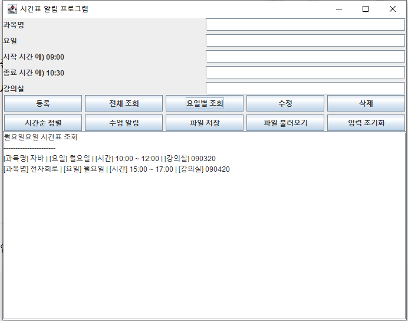

<!DOCTYPE html>
<html lang="ko">
<head>
<meta charset="UTF-8">
<title>시간표 알림 프로그램</title>

</head>

<body>

<h1>프로젝트 진행 지침</h1>

GitHub의 내용에서 발표용 페이지가 생성되었습니다.

<a class="menu-card" href="#overview">01. Project Overview →</a>
<a class="menu-card" href="#goal">02. Development Goal →</a>
<a class="menu-card" href="#features">03. Main Features →</a>
<a class="menu-card" href="#structure">04. Class Structure →</a>
<a class="menu-card" href="#gui">05. GUI Implementation →</a>
<a class="menu-card" href="#implementation">06. Core Implementation →</a>
<a class="menu-card" href="#test">07. Testing Result →</a>
<a class="menu-card" href="#github">08. GitHub Management →</a>
<a class="menu-card" href="#release">09. Release →</a>
<a class="menu-card" href="#conclusion">10. Conclusion →</a>

<section id="overview">
<h2>01. Project Overview</h2>

시간표 알림 프로그램은 학생들이 개인 시간표를 효율적으로 관리할 수 있도록 개발한 Java Swing GUI 프로그램이다.
과목명, 요일, 시간, 강의실 정보를 등록하고 조회·수정·삭제할 수 있으며 수업 시작 전 알림 기능을 제공한다.

<a class="back" href="#top">↑ 목차로 돌아가기</a>
</section>

<section id="goal">
<h2>02. Development Goal</h2>
<ul>
<li>개인 시간표 관리 편의성 향상</li>
<li>수업 일정 확인 지원</li>
<li>수업 시작 전 알림 기능 제공</li>
<li>Java 객체지향 프로그래밍 학습</li>
<li>파일 입출력 기능 활용</li>
</ul>
<a class="back" href="#top">↑ 목차로 돌아가기</a>
</section>

<section id="features">
<h2>03. Main Features</h2>
<ul>
<li>시간표 등록</li>
<li>시간표 전체 조회</li>
<li>요일별 조회</li>
<li>시간표 수정</li>
<li>시간표 삭제</li>
<li>시간순 정렬</li>
<li>수업 알림</li>
<li>파일 저장 및 불러오기</li>
</ul>
<a class="back" href="#top">↑ 목차로 돌아가기</a>
</section>

<section id="structure">
<h2>04. Class Structure</h2>
<table>
<tr>
<th>클래스</th>
<th>역할</th>
</tr>
<tr>
<td>Main</td>
<td>프로그램 실행 시작</td>
</tr>
<tr>
<td>Subject</td>
<td>시간표 데이터 저장</td>
</tr>
<tr>
<td>ScheduleManager</td>
<td>시간표 관리 기능 처리</td>
</tr>
<tr>
<td>TimetableApp</td>
<td>GUI 및 사용자 입력 처리</td>
</tr>
</table>
<a class="back" href="#top">↑ 목차로 돌아가기</a>
</section>

<section id="gui">
<h2>05. GUI Implementation</h2>

Java Swing을 활용하여 GUI 기반 시간표 관리 프로그램을 구현하였다.
사용자는 입력창과 버튼을 통해 시간표를 등록, 조회, 수정, 삭제할 수 있다.

<a class="back" href="#top">↑ 목차로 돌아가기</a>
</section>

<section id="implementation">
<h2>06. Core Implementation</h2>
<ul>
<li>ArrayList를 활용한 시간표 관리</li>
<li>중복 시간 검사 기능 구현</li>
<li>요일별 조회 기능 구현</li>
<li>Comparator를 활용한 시간순 정렬</li>
<li>ObjectOutputStream을 이용한 파일 저장</li>
<li>ObjectInputStream을 이용한 파일 불러오기</li>
<li>예외 처리 적용</li>
</ul>
<a class="back" href="#top">↑ 목차로 돌아가기</a>
</section>

<section id="test">
<h2>07. Testing Result</h2>
<ul>
<li>시간표 등록 정상 동작</li>
<li>전체 조회 정상 동작</li>
<li>요일별 조회 정상 동작</li>
<li>수정 및 삭제 정상 동작</li>
<li>시간순 정렬 정상 동작</li>
<li>파일 저장 및 불러오기 정상 동작</li>
</ul>
<a class="back" href="#top">↑ 목차로 돌아가기</a>
</section>

<section id="github">
<h2>08. GitHub Management</h2>
<ul>
<li>GitHub 저장소 생성</li>
<li>소스 코드 관리</li>
<li>README 및 docs 문서 작성</li>
<li>Issue 관리</li>
<li>Collaborator 협업 기능 활용</li>
</ul>
<a class="back" href="#top">↑ 목차로 돌아가기</a>
</section>

<section id="release">
<h2>09. Release</h2>

최종 버전 v1.0.0 Release를 생성하여 프로젝트를 배포하였다.

<ul>
<li>시간표 등록</li>
<li>전체 조회</li>
<li>요일별 조회</li>
<li>수정 및 삭제</li>
<li>수업 알림</li>
<li>파일 저장 및 불러오기</li>
</ul>
<a class="back" href="#top">↑ 목차로 돌아가기</a>
</section>

<section id="conclusion">
<h2>10. Conclusion</h2>

본 프로젝트를 통해 Java GUI 프로그래밍, 객체지향 설계, 파일 입출력, GitHub 활용 방법을 학습할 수 있었다.
또한 기능별 클래스를 분리하여 유지보수성과 가독성을 향상시켰으며 실제 시간표 관리 프로그램을 구현하였다.

<a class="back" href="#top">↑ 목차로 돌아가기</a>
</section>

</body>
</html>
